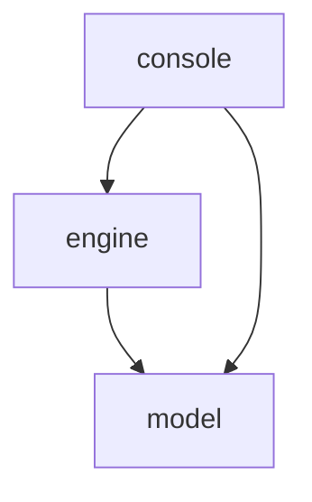

# Run
To run game enter next command in console:
```shell
sbt console/run
```
Or launch `game.console.ConsoleGame` class from **console** module in your IDE.

Game supports 6 command:
- **s**tart - starts new game with regenerated board and reset steps counter
- **q**uit - will print farewell message and exit application
- **u**p - will move empty square up
- **d**own - will move empty square down
- **l**eft - will move empty square left
- **r**ight - will move empty square right

# Project structure
Project consist from 3 modules: **model**, **engine** and **console**. On early stages they were just different packages in same module, but to enforce dependency order and to avoid cyclic dependencies I split them to separate modules. Modules dependencies:


## model
Contains all entities needed to describe game logic.

### `Direction`
Enum of 4 possible directions.

### `MoveError`
Case class to represent incorrect attempt to move.

### `GameStatus`
Enum to represent if game is ongoing or finished

### `Board`
Trait with few defined methods:
- `flat` returns iterator over board moving left-to-right, top-to-bottom
- `status` returns game status
- `move(Direction)` tries to move empty tile to specified direction

_Having board as `trait` rather than `[case] class` allows to change model without affecting consumers of `model` module._

Current implementation represented as `Vector` with some shuffle of values from 0 to 15, 0 meaning empty cell.

I could've chosen mutable `ArraySeq` for sake of performance, but I wanted solution to be in FP style. But still, from immutable collections `Vector` has the best combination of performances for random lookups and updates.

From representation point of view I could've chosen `Vector[Vector[Int]]`, but that would work only in case of mutable datta structures. With nested `Vector`s `Board#swap` would be much more complex and in some cases (moving up or down)
would involve 2 more updates (update corresponding horizontals and then update final structure).

Also, would be interesting to research if it is possible to provide some type-safe representation, e.g. have possible moves at type level as state as `Board[HList[Up, Left]]` or something like this. But I haven't found fast enough any variant, which would be possible to use, not to mention convenient. So I stayed with `Vector[Int]` version, because it gets work done and implementation isn't hard to read or test.

### `Game`
Simple wrapper of `Board` with step counter.

## engine
This module contains game loop and services needed for it.

### `Renderer`
Responsible for presentation of the game to user.

Has two methods:
- `Renderer#render` to render game
- `Renderer#showText` to show some message to player

### `CommandProvider`
Responsible for processing user input into commands and providing it to runtime.
Has single method `nextCommand`, which returns enum of:
- `StartNew` to start new game with regenerated board
- `Quit` to quit the game
- `Move(Direction)` to move empty cell in desired direction

### `Generator`
Needed for game start as it initialises new board. Currently, module have two implementations.

`ConsecutiveGenerator` was used on earlier development stages and left as demonstration. It generates board filled with numbers from 0(empty) to 15.

`RandomMovementGenerator` on the other hand provides correct generation.
It does that by taking solved board and applying specified number of moves. I believe it's possible to calculate some reasonable default with minimum number of moves, so that most of the tiles will be moved, but setting it to 1000 does the job and works fast enough to user not to pay attention.

After (very :)) fast research [I found](https://en.wikipedia.org/wiki/15_puzzle#Group_theory) an approach which won't use moves, but rather applying so-called 3-cycles. Having 3 different numbers (a b c), we can apply permutation (a->b, b->c, c->a) on board. It should be faster than `RandomMovementGenerator` so is a possible point of improvement.

### `GameRuntime`
Holds game loop. Essentially, endless cycle of "draw board; read command; process command".

By providing different implementations for engine services we can write different frontends for the game apart from `console` module of this project. For example using [Indigo](https://github.com/PurpleKingdomGames/indigo) it is possible to write web version of game, desktop(via Electron) or even mobile(via Cordova).

## console
Module with simple console implementation of the game

### `ConsoleRenderer`
Implements `Renderer` by drawing board as simple ASCII table and printing it to stdout, `showText` is simple `printLine`.

### `ConsoleCommandProvider`
Implements `CommandProvider` by waiting on user input, parsing command, on error retry.

### `ConsoleGame`
Wires implementations to game loop and start game.

# To improve
Here are some improvements, I think, should be done, but under limited time I decided to postpone them because of indefinite time costs and/or them being not first priority.

## Refine data model
Present `Board` implementation is quite leaky, i.e. `Renderer` implementations must utilize fact that I represent empty tile as 0. Ideally, implementations should be agnostic to internal representation of `Board`.

## Documentation
Currently, this README is the only documentation for this project. `model` and `engine` must have all their public API documented, ideally private as well. In case of `console`, as well as any other game implementation, code should have thorough docs of engine services implementations. By making so, we increase readability of code and simplifying maintenance, though it also depends on how good is data model and overall architecture.

## Better generation algorithm
As I already stated in [`Generator`](#generator) section, there is generation algorithm that theoretically is better than present one. Would be nice to write it, run some benchmark to compare.

## Tests
First of all, for `model` I could verify that `Board#move` actually does the right thing with few unit tests.

For `engine` I could test that `GameRuntime` handles `Command`s properly. Current implementation of `Generator` is correct by construction(well, at least theoretically), but to be sure that I wrote it correctly I could write some tests. But generally speaking each `Generator` implementation should be tested on solvability. That is, generator must generate solvable board. Moreover, it can be one test which works on `Generator` and I can supply there any implementation I need.

For `console` I could test that `ConsoleRenderer` draws `Board` correctly and that `ConsoleCommandProvider` correctly parses user input and handles errors.

## Indigo frontend
Not much of improvement, but rather battle test of current architecture and interesting task by itself.